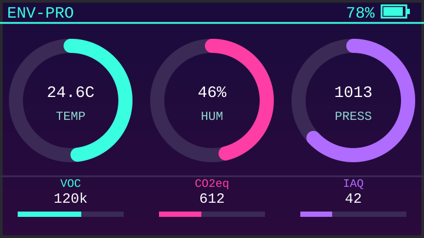

# CPEnvPro

A synthwave-themed environmental dashboard for the [M5Stack Cardputer ADV](https://docs.m5stack.com/en/core/Cardputer-Adv), built around the [ENV Pro Unit](https://docs.m5stack.com/en/unit/ENV%20Pro%20Unit) (BME688) — and it also runs on the plainer [ENV III](https://docs.m5stack.com/en/unit/envIII) and [ENV IV](https://docs.m5stack.com/en/unit/Unit_ENV-IV) units, auto-detected at boot.

*(mockup, not a device photo — the real screen is 240x135)*

## What it does

- Live temperature, humidity, and pressure on ring gauges, plus VOC (gas resistance), CO2-equivalent, and IAQ index when an ENV Pro is attached
- **Network mode**: scan for WiFi, connect, save credentials to the SD card so you don't re-type them next time, see the device's IP and `cpenv.local` hostname, and pull live sensor readings as JSON from any browser on the network
- **Logging mode**: write sensor readings to a CSV file on the SD card on a timer (10s–5min), each write opened/written/closed individually so a power loss can't corrupt the file
- **Graph mode**: view any logged metric as a line graph, scaled to however long you've actually been logging (capped at 24 hours), auto-refreshing as new data comes in
- Auto-detects which ENV unit is plugged in by its I2C address — the dashboard and graphs adapt to show only what that unit can actually measure

## Hardware

| | |
|---|---|
| Board | M5Stack Cardputer ADV (ESP32-S3) |
| Sensor | ENV Pro (BME688), ENV III (SHT30+QMP6988), or ENV IV (SHT40+BMP280) — any one, auto-detected |
| Storage | microSD card (required for network credentials, logging, and graphing) |

## The dashboard

The main screen always shows temperature, humidity, and pressure as ring gauges. With an ENV Pro attached, a second row adds VOC, CO2-equivalent, and IAQ; with an ENV III or IV (no gas sensor), the three gauges grow to fill the screen instead of leaving that row blank.

Press **m** to open the menu:

- **Network mode** — toggle WiFi on/off, pick a saved or new network, see connection status/IP/`cpenv.local`
- **Logging mode** — toggle logging on/off, set a filename, set the write interval
- **Graph mode** — only enabled once logging is on; view any available metric's recent history

## Controls

| Key | Action |
|---|---|
| `` ` `` (backtick, plain tap) | Screen off (from the dashboard) / step back a level (in network or logging mode) |
| Enter | Screen on / confirm a selection / force-refresh the graph |
| m | Open the menu (from the dashboard) / back to the dashboard |
| `;` / `.` | Scroll a menu, status rows, the WiFi scan list, or the logging interval list |
| `,` / `/` | Graph mode only — previous / next metric |
| space | Toggle temperature units C/F (dashboard, and the TEMP graph) |
| Fn+Backspace | Cancel out of WiFi password or log filename entry |

While typing a WiFi password or a log filename, all of the hotkeys above type as normal characters instead — text entry uses the physical keyboard directly, with the WiFi password shown in clear text (this device's keyboard is small enough that mistyping is a bigger risk than shoulder-surfing).

## Logging and graphing notes

- Log files are named `<name>_<N>.csv`, where `N` increments every time logging goes from off to on (or the filename is changed while already on). A reboot with logging left on resumes the same file rather than starting a new one.
- The timestamp column is only populated when network mode is on and NTP has synced; otherwise it's left blank (in UTC when present) so the CSV's column count never changes row to row.
- Graph mode reads the log file backward from the end in small fixed-size chunks, so a log that's grown over many days costs the same read time as a fresh one — it never scans the whole file.

## Building and flashing

This is an Arduino sketch (`CPEnvPro/CPEnvPro.ino`) built for **Launcher**-managed devices, installed as an app binary rather than flashed directly:

1. Open in the Arduino IDE with the M5Stack board package installed
2. Board settings need an 8MB flash size with a large-APP partition scheme (WiFi + SD + mDNS don't fit in the default 4MB/1.3MB-app scheme) — check what your Launcher partition actually allocates and match it, since that's the real ceiling, not whatever the Arduino IDE compiles against
3. **Sketch → Export Compiled Binary**, then install the resulting app `.bin` (not the merged/bootloader files) through Launcher

### Dependent libraries

M5Unified, M5GFX, M5Cardputer, M5UnitUnified, M5Utility, M5HAL, M5Unit-ENV, BME68x Sensor library, bsec2 — all available through the Arduino Library Manager.
